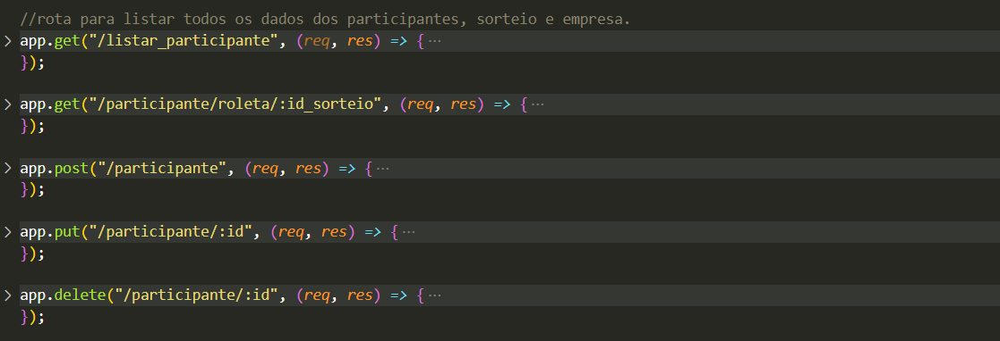
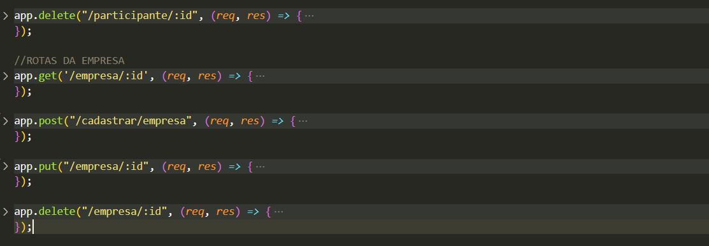
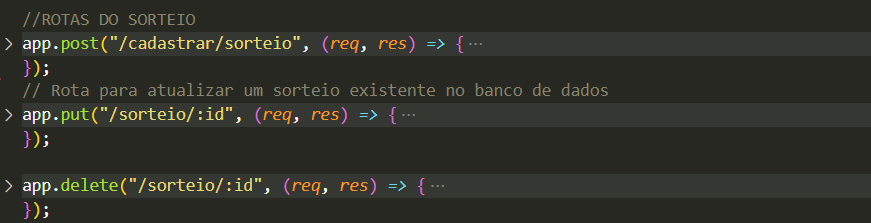

# API Roleta de Equipes
API backend desenvolvida utilizando **Node.js**, **Express** e **MySQL** para gerenciar dados de participantes, empresas e sorteios. O objetivo principal é automatizar, facilitar e organizar o processo de sorteio de equipes de vendas.

## Tecnologias Utilizadas

- **Node.js**: Ambiente de execução JavaScript.
- **Express**: Framework para Node.js para construção de APIs.
- **MySQL**: Banco de dados relacional.
- **Multer**: Middleware para manipulação de uploads de arquivos.
- **Bcrypt**: Biblioteca para criptografia de senhas.
- **PDFKit**: Biblioteca para geração de arquivos PDF.
- **csv-parser**: Leitor de arquivos CSV.
- **xlsx**: Manipulação de arquivos Excel.

## Funcionalidades

A API fornece as seguintes funcionalidades:

### **Participantes**

- **Listar**: GET => Para listar todos os participantes cadastrados.
- **Cadastrar**: POST => Permite o cadastro de participantes no sorteio.
- **Atualizar**: PUT => Atualiza os dados de um participante.
- **Deletar**: DELETE => Remove um participante.

### **Empresas**

- **Cadastrar**: Permite o cadastro de empresas participantes.
- **Atualizar**: Atualiza os dados de uma empresa.
- **Deletar**: Remove uma empresa.

### **Sorteios**

- **Cadastrar**: Permite o cadastro de sorteios.
- **Atualizar**: Atualiza os dados de um sorteio.
- **Deletar**: Remove um sorteio.
- **Gerar PDF**: Gera um PDF com os resultados do sorteio.
  
### **Uploads de Arquivos**

- **Upload de CSV/XLSX**:
- POST /upload
- Permite o upload de arquivos CSV e Excel com dados dos participantes para serem importados
automaticamente para o sistema.

# 🛠️ Estrutura de Banco de Dados (Resumo)
- participante: nome, equipe, supervisao, id_sorteio, via_qr.
- empresa: id_empresa, empresa, data_sorteio, periodo.
- sorteio: id, nome_responsavel, email_responsavel, senha_responsavel, data_criacao, status, etc.

## 👩‍💻 Desenvolvido por
Kaylane Coutinho.
=======
# API Roleta de Equipes

API backend desenvolvida em **Node.js**, **Express** e **MySQL** para gerenciar participantes, empresas e sorteios de forma automatizada e organizada. O sistema facilita o processo de sorteio de equipes de vendas.

---

## Tecnologias Utilizadas

- **Node.js** — Ambiente de execução JavaScript.
- **Express** — Framework para criação de APIs RESTful.
- **MySQL** — Banco de dados relacional.
- **Multer** — Middleware para manipulação de upload de arquivos.
- **Bcrypt** — Biblioteca para criptografia de senhas.
- **PDFKit** — Geração de arquivos PDF.
- **csv-parser** — Leitura de arquivos CSV.
- **xlsx** — Manipulação de arquivos Excel.

---

## Funcionalidades

### Participantes

- **Listar** — GET /participante

  Lista todos os participantes cadastrados no sistema.

- **Cadastrar** — POST /participante

  Permite cadastrar um novo participante no sorteio.

- **Atualizar** — PUT /participante/:id 

  Atualiza os dados de um participante específico.

- **Deletar** — DELETE /participante/:id 

  Remove um participante do sistema.

---

### Empresas

- **Cadastrar** — POST /empresa

  Permite o cadastro de novas empresas.

- **Atualizar** — PUT /empresa/:id  

  Atualiza informações de uma empresa existente.

- **Deletar** — DELETE /empresa/:id

  Remove uma empresa do sistema.

---

### Sorteios

- **Cadastrar** — POST /sorteio 

  Cadastra um novo sorteio.

- **Atualizar** — PUT /sorteio/:id 

  Atualiza dados do sorteio.

- **Deletar** — DELETE /sorteio/:id 

  Remove um sorteio.

- **Gerar PDF** — GET /sorteio/:id/pdf

  Gera um arquivo PDF com os resultados do sorteio.

---

### Uploads de Arquivos

- **Upload CSV/XLSX** — POST /upload  

  Permite o upload de arquivos CSV e Excel contendo dados de participantes para importação automática.

---

## Estrutura do Banco de Dados (Resumo)

| Tabelas        | Principais campos adicionados                                        | Descrição das tabelas                            |
|---------------|----------------------------------------------------------|-------------------------------------|
| participante | id, nome, equipe, supervisao, id_sorteio, via_qr | Dados dos participantes e associação ao sorteio. |
| empresa    | id_empresa, empresa, data_sorteio, periodo      | Informações das empresas participantes.           |
| sorteio     | id, nome_responsavel, email_responsavel, senha_responsavel, data_criacao, status | Dados e status dos sorteios.          |

---
